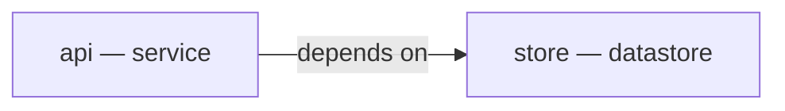
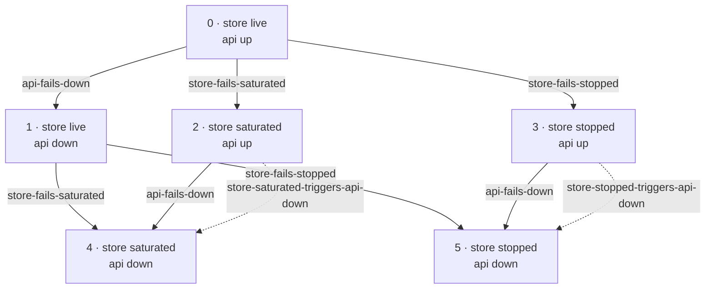
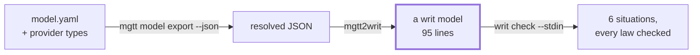
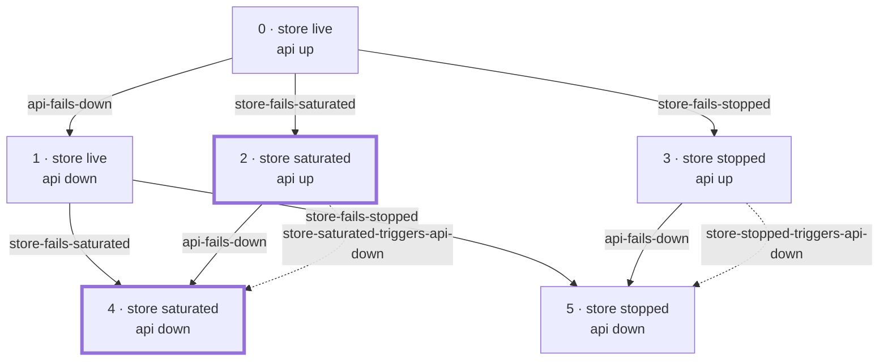
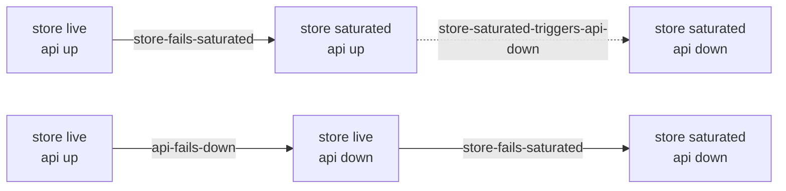

# mgtt2writ

**Find the contradictions in an architecture model that no test will catch.**

This is a small tool with one job, and the job only makes sense once you've seen
the problem it solves. So this page starts with the problem.

---

## A two-component system

[mgtt](https://github.com/mgt-tool/mgtt) lets you describe a system — what its
parts are, what depends on what, and what "healthy" means for each part — and
then reason about it. Here is about the smallest useful example: a store, and an
API in front of it.

```yaml
components:
  store:
    type: datastore
  api:
    type: service
    depends:
      - on: store
```



The interesting part isn't the model, it's the *type*. A `datastore` declares two
observable facts, and then says two different things about them:

```yaml
facts:
  available:        { type: mgtt.bool }
  connection_count: { type: mgtt.int }

healthy:                                  # when should nobody be paged?
  - available == true
  - connection_count < 500

states:                                   # what is it doing right now?
  live:       { when: "available == true & connection_count < 500" }
  saturated:  { when: "available == true & connection_count >= 500" }
  stopped:    { when: "available == false" }

default_active_state: live
```

Read those two blocks again. `healthy:` and `states:` are **two predicates over
the same two facts**, written in different places for different purposes. Right
now they agree: a store is healthy exactly when it's `live`.

Nothing in mgtt requires them to keep agreeing.

---

## The change that breaks it

Months later, someone is tired of being paged when the pool fills up. A saturated
store is still serving traffic. So they loosen the health condition for that one
component:

```yaml
components:
  store:
    type: datastore
    healthy:
      - available == true          # dropped the connection_count clause
```

This is a reasonable-sounding edit. It is also valid: `mgtt model validate`
passes, because that's a well-formed expression over a fact that exists.

But the type's `states:` block was not touched. It still says a store with an
exhausted pool is `saturated`, not `live`. So the model now says a component can
be **healthy and not in its active state at the same time** — and mgtt's own
engine reads one of those blocks in one code path and the other in another. Give
it a saturated store and `simulate` and `diagnose` can reach different verdicts.

---

## Why no test catches it

The obvious answer is "write a scenario for it". A scenario in mgtt injects some
facts and asserts what the engine should conclude:

```yaml
inject:  { store: { available: true, connection_count: 900 } }
expect:  { root_cause: store }
```

That works — *if you thought to write it*. And you wouldn't, because a scenario
tests a **conclusion**, and there's no wrong conclusion here to notice. The bug
isn't that the engine answers a question badly. It's that two things you wrote,
in two places, months apart, no longer agree with each other. There's no single
input that makes it obviously wrong; there's just an inconsistency sitting in
the model.

To find it, you'd have to check every configuration the system can be in and ask
"do these two definitions agree here?" — in all of them, not in the ones you
thought of.

That is a different kind of question, and it needs a different kind of tool.

---

## Checking every configuration

[writ](https://github.com/writ-lang/writ) is a language for models small enough
to be checked *completely*. You describe a finite world; it enumerates every
situation that world can reach and answers your questions over all of them at
once, with a route showing how it got there.

"Every configuration" sounds expensive, and for this system it isn't. The store
has 3 states, the api has 2:

```
3 × 2 = 6 situations
```

Six. You could check them on paper — and here they are, with every move
between them. Solid arrows are a component failing on its own; dotted ones are a
failure crossing the dependency edge:



Nine arrows, two situations with no way out. Everything starts at 0, healthy. A real model has more, but far fewer than
you'd fear, because the situations that matter are the ones actually reachable
by failures propagating — not every combination imaginable.

So: mgtt has the description, writ has the checker, and they speak different
languages.

**That gap is this tool.** `mgtt2writ` reads what mgtt exports and writes what
writ reads. It does nothing else.



Only the middle arrow is this tool. mgtt owns the first, writ owns the last, and
neither of them knows the other exists.

---

## What it produces

mgtt can export its model — types resolved, overrides applied — as JSON.
`mgtt2writ` turns that into a writ model. For the store, the two facts become
enumerated types holding just the distinctions the model actually makes:

```lisp
(type datastore-available        (yes no))
(type datastore-connection-count (below-500 at-or-above-500))
```

`connection_count` is an integer, and writ has no numbers. It doesn't need them:
the only thing any rule in the model asks is which side of 500 the value falls
on, so that's what gets carried. Two members, not two billion.

The failure modes become moves, named so a failure chain reads as one:

```lisp
(transition store-fails-saturated
  (when (and (is store.available yes) (is store.connection-count below-500)))
  (do  (set store.connection-count at-or-above-500)))
```

And the agreement between `healthy:` and `states:` — the thing nothing was
checking — becomes a **law**, stated once and then checked in every situation:

```lisp
(equation datastore-health-matches-state
  (iff (and (is datastore.available yes) (is datastore.connection-count below-500))
       (and (is datastore.available yes) (is datastore.connection-count below-500))))
```

Both sides identical, because in the healthy version of this model the two
definitions agree. That's what "no finding" looks like.

---

## Running it

Three commands, each doing its own step:

```console
$ mgtt model export --json | mgtt2writ | writ check --stdin
states: 6   edges: 9
gaps: none
dead ends: 2
equation datastore-health-matches-state
  can be broken by: store-fails-saturated, store-fails-stopped   (acknowledge in claims)
$ echo $?
0
```

Six situations, as predicted. `can be broken by` lists the moves that *touch*
the facts the law reads — a heads-up, not a problem. Exit 0: nothing is wrong.

Now on the model with the loosened health condition:

```console
$ mgtt model export --json model-drifted.yaml | mgtt2writ | writ check --stdin
states: 6   edges: 9
equation datastore-store-health-matches-state
  can be broken by: store-fails-saturated, store-fails-stopped   (acknowledge in claims)
  violated in 2 reachable situations   witness: 1. store-fails-saturated
$ echo $?
1
```

**Two of the six.** You can check that by hand, which is the point. It is the
same six situations as before, with the two the law now fails in marked:



The two thick ones are exactly the situations where the store is **saturated** —
healthy by the loosened rule, not `live` by the type's rule. The api being up or
down makes no difference to the contradiction, which is why it is two and not
one. `witness: 1. store-fails-saturated` is
the shortest way to reach one: a single failure, from a healthy start.

Exit 1 means a finding, so this drops into CI beside your other checks.

For everyday use, one command does all three:

```console
$ mgtt-contradict-check
```

Same pipeline, same exit status. It ships here.

---

## A second question: which failures can't be told apart

The check above finds contradictions *in the model*. There is a different
failure the same six situations can show you, and it is about what happens at
3am.

Look again at situation 4 — the store saturated, the api unreachable. Two
different things could have happened:



**The store took the api down with it** — one root cause. Or **the api failed on
its own and the store saturated separately** — two. Both end in the same place,
and every fact reads the same either way. There is no probe that separates them,
because there is nothing left to probe.

`mgtt diagnose` still has to answer. Occam's razor picks the single cause, so it
names the store — and it is wrong every time the second story is what actually
happened. That isn't a weakness in the engine; it is a property of this model,
and it is worth knowing before you're paged rather than after.

`mgtt2writ --rules` writes the questions that find it:

```console
$ mgtt model export --json > m.json
$ mgtt2writ         < m.json > m.writ
$ mgtt2writ --rules < m.json > m.rules
$ writ derive m.writ m.rules unattributable
unattributable  (2 rows)
  4
  5
```

Two of the six — the ones where the api is down and something else has also
failed. In those, "why is the api down?" has two answers and no evidence to
choose between them.

The fix isn't a better engine. It's a **fact that tells the stories apart** —
something a probe can read that differs depending on which happened. Add it to
the type, and the two situations stop being the same situation.

Per-component questions are there too, when you want to know who is affected:

```console
$ writ derive m.writ m.rules unattributable-api
```

`store` gets no such relation, and that absence is the answer for it: nothing
depends on the store, so nothing can push it over, so its failures are always
its own.


---

## Install

```sh
make install                      # -> ~/.local/bin  (needs OCaml + dune)
make install PREFIX=/usr/local
opam install .                    # or via opam
```

OCaml ≥ 4.14 and dune ≥ 3.0 to build, and **nothing else**. writ's JSON reader
is vendored under `vendor/` rather than depended on, so a writ release can't
break this tool without someone choosing to sync.

You'll also need `mgtt` and `writ` on `PATH` — this tool is the middle of a
pipeline, not the whole of one.

## Reference

`mgtt2writ` is a filter: stdin to stdout, no file argument. One that could also
read a file could be invoked a second way nobody documented.

| | |
|---|---|
| `mgtt2writ` | translate stdin to stdout |
| `mgtt2writ --rules` | write the diagnosability rules instead of the model |
| `mgtt2writ --strict` | exit 1 if anything was declined |
| `mgtt2writ --version` | the version this binary was built from |

Exit: **0** translated · **1** a decline under `--strict` · **2** unreadable
input.

Anything the export says that a writ model can't hold is reported on **stderr**,
never dropped — a model translated in silence would let "writ found nothing" be
a claim about an architecture nobody has. Declines aren't failures by default,
since a large model usually has some; `--strict` makes them cost exit 1, which
is the shape a CI check wants once you've read them once.

---

## Why this is a separate tool

Neither project should carry a command naming the other. mgtt isn't a writ front
end and writ isn't an mgtt checker; an adapter between two systems belongs to
neither — the same reasoning that makes mgtt's providers external plugins.

An earlier version put the translation inside writ as a `writ mgtt` verb and
wrapped it in mgtt as `mgtt verify`. Both were removed. The full argument is
[ADR 0001](https://github.com/mgt-tool/mgtt/blob/main/docs/decisions/0001-where-the-writ-bridge-lives.md).

## How the translation works

The claim this tool rests on is that mgtt's facts stop being numbers **without
losing anything**. That holds because mgtt's expression language has six
comparison operators and no arithmetic, so the constants a model mentions cut
each fact's values into finitely many regions on which every predicate is
constant — and two values in one region were already indistinguishable to mgtt's
own engine.

[`docs/reading.md`](docs/reading.md) works the whole mapping through, including
the parts that were harder than they looked.

## Testing

```sh
make test        # 74 unit checks; no writ needed
make pipeline    # 3 end-to-end checks against the real binaries
make check       # both
```

Two suites, and the split is forced rather than chosen —
[`docs/testing.md`](docs/testing.md) explains why.

## License

Copyright (C) 2026 Alex Kunich. **GNU Affero General Public License, version 3
or later** ([LICENSE](LICENSE)) — the terms writ ships under, since this began as
code in its tree. A model this tool emits is your own work; see [NOTICE](NOTICE).
